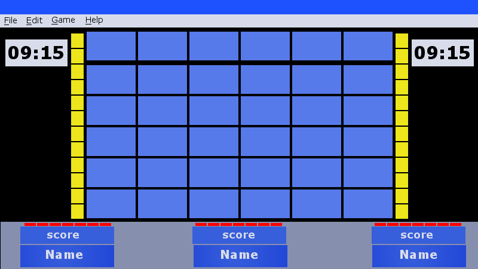

===========================
Initial Design for Jeopardy
===========================

I would like to keep to the look and feel of the television show as much as possible, using fonts and colors and
proportions of the playing board as much as I can.

I would also like to keep to the Model-View-Controller architecture in developing the program. I liked the explanation
given on pages 37 and 38 of `Android Programming - The Big Nerd Ranch Guide, 3rd Edition` especially as it pertains to
keeping the layers separate so that, for instance, the View layer doesn't need to know anything about the Model layer
and can concentrate on it's own duties of displaying the user interface (UI). The Controller layer is the only
connection between the Model layer and the View layer and thus is where most of the "works" of the program reside.

As I start the design process I'm thinking in terms of three separate files contain three separate classes:

.. csv-table:: **MVC Design for Jeopardy**
    :header: Layer, Class, Duties
    :widths: 12, 15, 50

    Model, Question, Holds values for the category; answers; questions and daily double status
    View, JeopardyWindow, builds the MainWindow and all of the widgets needed to play Jeopardy (see below)
    Controller, JeopardyGame, sets up the game and controls all of the widgets

First Thoughts on the Operation of the Program
==============================================

To guide my thinking perhaps I should do a narrative run-through of using the program to see what features it should
have. This needs to be from two points of view: 1) as Jeopardy games are being designed and 2) as Jeopardy games are
being played.

The Basic User Interface
------------------------

The window that appears when the game is started is the same for both of the basic functions of the game. A main window
appears with a menu at the top. Underneath the menu area is the central area containing the Jeopardy board, the
scoreboard and somekind of indicator the tells when players can ring in. Perhaps there should also be an indicator as to
whether buttons are being used or some kind of call out system is being used.

The Jeopardy board consists of six rows and six columns of mock video screens. When the game opens, the word "Jeopardy"
is spelled out on these screens.

The scoreboard indicates not only the current score of each player or team of players but that player's name. It also
brightens or shows some other indication when that player buzzes in to respond.

.. _designing-games:

Designing Jeopardy Games
------------------------

To create or edit a set of answers and questions there must not be a current game in progress, thus any menu entries
pertaining to game editing are inactive when a game is in progress.

If no game is in progress and the user wants to create a new Jeopardy Quiz File (.jqz) containing clues and correct
responses for Jeopardy, Double Jeopardy and Final Jeopardy, he or she goes to the file menu and selects "Create...".
The main board fills with words in small type indicating what sort of thing goes in that box: a category or a clue. The
user clicks on the square he or she wants to fill and a dialog box opens for that kind of item.

The game being created can be saved at any time but only after it is complete will it be able to be played. This will
necessitate some way of letting the program know which Jeopardy files can be played.

Category items allow the user to enter the category's name and an explanation of that category if needed -- for
instance, a category named "Fits to a "T" might need to tell the players all questions will start with the letter "T".
Clue items will indicate the category it belongs to, the clue to be displayed, and the correct response. The program
will select the positions of the Daily Doubles at run time. A complete game, ready for playing, consists of a game
category (Science, Catholic Faith, Church History, etc.), a game name, and a complete set of Jeopardy, Double Jeopardy
and Final Jeopardy clues and responses. Once that is all present the game can be marked as playable. See
:ref:`model_design` section below.

If possible it would be good to enter the Jeopardy clues as they will appear on the screen during the game so that the
user can see if it fits or not. Perhaps have some limited editing tools such as a choice of font sizes: normal and
small.

Perhaps each .jqz file can have a title and description indicating such things as topics and target audiences.

If the user wants to edit a previously saved package, he or she can click File --> Open... to select which file to
edit. There can be an Edit menu with a selection "Add Title..." and/or "Add Description..." to fulfill the possibility
stated immediately above.

In edit mode clicking on any of the squares opens the same dialog box used for editing before.

Playing Jeopardy Games
----------------------

When the leader clicks the "Play..." entry in the file menu a dialog box opens displaying the available games. This
implies they all have to be in the same directory but perhaps there can be subdirectories within that directory. The
dialog box displays the given information about each game such as its topic and the target group.

When the program is first started there are some things that may or not be done. These will be collected in a "Game"
menu. Player or team names can be edited (default: Team A, Team B and Team C). Players can be given a chance to practice
with the switches if they are to be used. A game can be selected (from the "File" menu?) at any time. Game play will not
commence until the leader clicks "Play Jeopardy" on the Game menu.

When "Play Jeopardy" is clicked a Jeopardy match is started. When the Jeopardy match is over, "Play Double Jeopardy" may
be clicked. Similarly, when Double Jeopardy is over, "Play Final Jeopardy" may be clicked.

At the beginning of either a Jeopardy or Double Jeopardy match, the categories and their explanations are displayed.
Perhaps this can be done as a timed sequence that can be repeated for a particular category by clicking on it or the
leader can just read the names of the categories and their explanations.

When the first player has selected a category and an amount, the leader clicks the corresponding square and the answer
grows on the screen from that square. Once the leader reads the question he or she clicks a key (the space bar?) and a
timer is started for that match, another timer for the current question, and the buttons are activated. The first player
or team to click in is indicated by a chime and their name/score "lighting up" on the screen. If the player's response
is correct, the leader presses the plus key and that amount is added to their score. If the response is not accepted
the leader presses the minus key and that amount is subtracted from the player's score. Once clicking in a player has
five seconds to give a response -- actually more like six seconds since there will be a slight delay to call the
player's name. This delay will be built into the timing lights over each player's score. If the player does not answer
in time the amount for that clue will be subtracted from their score. The leader can stop this question timer by tapping
a key. (Which one? I don't know yet.)

The last correct questioner in a match is always the one to make the next selection. At the beginning of Double Jeopardy
the player with the lowest score is the one to select first.

During a match there may be a need to correct a mistake the leader makes. This can be done by going to the game menu and
clicking on "Correct Scores...". The game timer is paused until the leader presses the spacebar to activate the switches
for the next question.

When the time is up for a match a sound effect is played to indicate this unless there are no more answers to select
from and then the match is over anyway.

When the leader clicks "Play Final Jeopardy" the category appears on the screen and the players write their wagers
independently. When the leader clicks the "Final Jeopardy" square the Final Jeopardy answer appears and the Jeopardy
music begins. The players write out their answers until the music ends when they must stop writing. The leader then
receives and tallies the scores for the three players or teams and the game is over.

Initial Design Thoughts
=======================

Based on the descriptions above, here are my initial thoughts as to the design of the Jeopardy program:

The User Interface
------------------

It will be a main window program with a menu. The top menu entries will be File, Edit, Game and Help. Here are some
possible entries into those three menus:

| **File:**
|     Open...
|     -
|     Create...
|     Modify...
|     Save
|     Save As...
|     Close
|     -
|     Exit

| **Edit:**
|     Add Game Info... [Name, Category, Description]
|     -
|     Copy(?)
|     Paste(?)

| **Game:**
|     Set Names...
|     Practice...
|     Play Jeopardy!
|     Correct Scores...

| **Help:**
|     Using this Program
|     Rules of the Game
|     -
|     About

The central window will have the game board, a scoring section with names and scores, a set of "lights" around the board
to indicate when the players may buzz in and a couple of timers, one showing how much time is left in a match, the other
showing how much time is left to respond to the current clue. (The latter can be a column of lights perhaps, the same
column of lights that indicates that the players may press their buttons.) Each player also has a set of timing lights
indicating their five seconds to respond after buzzing in.

Here is an intial sketch of the user interface:

.. _model_design:

The Models
----------

Looking over the :ref:`designing-games` section above, I see that perhaps three models could be useful:

.. csv-table:: **The Models**
    :header: Model Name, Contents
    :widths: 12, 68

    GameModel, playable (boolean); game_category; game_name; Jeopardy (list of categories); DoubleJeopardy (list of categories); FinalJeopardy (one category)
    Category, title (string); explanation (string); items (list of items)
    Item, clue (string); correct_response (string)

|

That initial plan led, eventually, to the following structure for the three models:

.. csv-table:: **The GameModel Class**
    :header: Field, contents, comments
    :widths: 20, 20, 40

    playable, boolean, true if the game is finished for play
    category, string, optional-to give the game a category
    name, string, optional-to give the game a name
    target-group, string, description of the group anticipated to play the game
    jeopardy, list of categories, the clues and responses for the Jeopardy portion of the game
    double-jeopardy, list of categories, the clues and responses for the Double Jeopardy portion of the game
    final-jeopardy, category, the clue and response for the Final Jeopardy portion of the game

|

.. csv-table:: **The CategoryModel Class**
    :header: Field, contents, comments
    :widths: 20, 20, 40

    title, string, category title to appear on board
    description, string, optional explanation for that category
    items, list of ItemModels, contain the clues and responses for that category in order from least to most valuable

|

.. csv-table:: **The ItemModel Class**
    :header: Field, Contents, Comments
    :widths: 20, 20, 40

    clue, string, the clue to appear on the board when its square is clicked
    response, string, the correct response to the clue appearing when no one gets it right

The Next Step
=============

That completes the initial design of the program. I left out many of the details of the user interface as it will
involve a lot of research into the capabilities of PyQt5's widgets, etc.

Chances are, many of the details of this design will change before the program is finally implemented but I think I have
a good start. Here is a plan for implementation -- not necessarily the play I will end up following but it's good to
have plans anyway.

#. Build the model classes. (See :doc:`models`)

#. Create a temporary program to create a .jqz file to test the models

#. Create the user interface.

    A. Build the Board

    #. Add the system for creating and editing .jqz files

    #. Add the system for playing the game

        i. Build the Scoreboards

        #. Build the Buzz in system

        #. Build the timers

This requires more thought. Am I keeping to the MVC model? It seems the View and the Controller are being built
together. Is that what I want?
