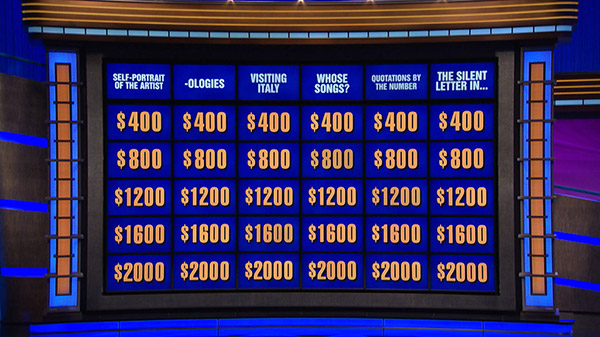
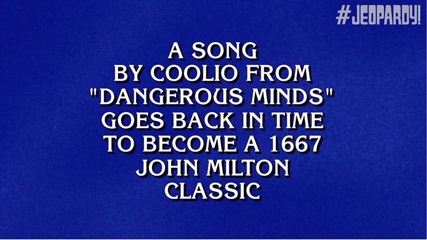

===========================
Building the User Interface
===========================

To try to keep to the MVC philosophy, I'm going to try to keep the user interface in one class and all the controlling
functions, like what to do on a menu click, in a separate class subclassed from the user interface class so as to have
access to all of its parts. I'm not sure how this will work but I'll try it out on the menu as soon as I build it.

Here is the order I will follow in building the user interface:

#. Write the main application loop to show the main window.
#. Add a menu to the main window.
#. Build the main game board.
#. Build the scoreboards.
#. Build the lights at the side of the board.
#. Create the various timers needed for the game.

I will simultaneously be working on the controller class so I can experiment as I go. My notes on this will be in the
<controller> document.

1. Creating the User_Interface Class
====================================

This is very much like what QtDesigner does so I should follow its example. In a QtDesigner program, the structure is
something like this::

    class MainWindow(QDialog, ui_dssassistant.Ui_DSSAssistant):

        def __init__(self, parent=None):
            super(MainWindow, self).__init__(parent)
            self.setupUi(self)
            ...

    if __name__ == "__main__":
        import sys

        app = QApplication(sys.argv)
        app.setApplicationName('DSS Assistant')
        form = MainWindow()
        form.show()
        app.exec()

Meanwhile, in the ``ui_dssassistant.py`` file the ``Ui_DSSAssistant`` class definition begins as follows::

    class Ui_DSSAssistant(object):
        def setupUi(self, DSSAssistant):
            DSSAssistant.setObjectName(_fromUtf8("DSSAssistant"))
            DSSAssistant.resize(622, 501)
            self.tcMain = QtGui.QTabWidget(DSSAssistant)
            self.tcMain.setGeometry(QtCore.QRect(10, 10, 601, 441))
            self.tcMain.setObjectName(_fromUtf8("tcMain"))
            self.tbControls = QtGui.QWidget()
            self.tbControls.setObjectName(_fromUtf8("tbControls"))
            self.lbProgramName = QtGui.QLabel(self.tbControls)
            self.lbProgramName.setGeometry(QtCore.QRect(30, 10, 91, 51))

I notice that the class inherits from ``object`` and contains the ``setupUi`` method using ``DSSAssistant`` as a
parameter that picks up the ``self`` (a.k.a. MainWindow) argument from the method call in the main program. Meanwhile,
``self`` in this part of the program refers to the ``Ui_DSSAssistant`` instance in which the ``setupUi()`` method is
found.

So, to duplicate something like that for the Jeopardy program the main program will subclass the UI as follows::

    class Jeopardy(QMainWindow, jeopardy_ui.Jeopardy_UI):

        def __init__(self, parent=None):
            super(Jeopardy, self).__init__(parent)
            self.createUi(self)

    if __name__ = "__main__":
        import sys

        app = QApplication(sys.argv)
        app.setApplicationName('Jeopardy')
        form = Jeopardy()
        form.show()
        app.exec()

2. Adding the Menu
==================

This was fairly straightforward, though I had a lot of re-learning to do and the process helped me re-think some aspects
of the program -- like allowing editing of the game file during a match.

Perhaps the biggest discovery was that I could include the "slots" in the ``jeopardy_ui.py`` file while the methods to
which they refer are in the ``jeopardy.py`` file thus keeping the user interface code out of the controlling code as
much as possible.

3. Building the Main Board
==========================

The main board will consist of 36 "screens" which I may call "elements" to avoid confusion with the computer screen or
the QScreen class. I need to carefully think through how these "elements" will look and act.

The Elements of the Main Board
------------------------------

There are two types of elements, those that display category names and those that display dollar amounts, clues and
correct responses to those clues. Here is an image of the main board from the official
`Jeopardy! website <http://www.jeopardy.com>`

Using GIMP to measure the elements and gaps I come to the following conclusions:

#. All of the elements, both for categories and for clues, have a 16:9 aspect ratio. (1.77778)
#. The gap between all of the elements (except as noted below) is about 1/20 the width of an element.
#. The gap between the categories and the clues is twice that amount.

Also, a white font of various sizes is used for the categories and a "gold" font for the dollar (or point) amounts. All
caps are used and, the font used to display the category names and dollar/point amounts seems to be sans-serif.
Another image shows that the clues are given in a white serif font with a black drop shadow downward and to the right:

The image size of the above, by the way, tends to confirm the aspect ratio of the elements as 16:9. (840/473 = 1.7759)

It may also show that the blue background is not a flat blue but has some texture to it which I can probably reproduce
in Blender.

Each element needs to display the blue background and various texts: the dollar/point amount, the clue and the correct
response. During editing it would be nice to have these editable. It would be great if they could animate themselves to
grow into something more readable when selected during a game, scaling the text appropriately. Being able to print the
clues and correct responses will also be necessary for the leader. (I will need to add a ``Print...`` menu item to the
``File`` menu.)

Practice with Elements
----------------------

I've been practicing with a BoardElement class just to see what I can see. Here is a somewhat random list of what I've
seen:

#. I think I may need to create a separate Board class to, itself, build the board from elements.
#. Perhaps the Board class should inherit from QGraphicsView.
#. The job of painting the BoardElements goes to its own paint() method. It comes with three useful(?) parameters.
#. I think I can draw shadowed text by drawing black text behind white text shifted downward and to the right.
#. I need to study how to center the text.
#. This may help: http://www.cesarbs.org/blog/2011/05/30/aligning-text-in-qgraphicstextitem/
#. It may be useful to imagine what I would like the BoardElement to be able to do. I'll do that next.

Desires and Requirements for the Board Elements
-----------------------------------------------

#. At its most basic level, an element must be able to display text in various sizes and colors.
#. Elements should be able to animate from their original position to fill the whole board area.
#. Or else a screen or a view could zoom in on them.
#. Elements should be clickable, but with different effects during a game and during editing.
#. The text alignment on an element should be centered.
#. An element should have several setting methods to set text for:
    A. Categories
    #. Dollar/Point Amounts
    #. Clues
    #. Correct Responses
#. Elements can set a QPixmap background

That's all I can think of for now.

Board Element (Display Unit) Design
-----------------------------------

Thinking about how the BoardElement class is going to be used brings the following questions and ideas:

#. Is BoardElement really a good name for the class?
#. I foresee the use of several class variables for the different texts to be displayed: categories, dollar/point
   amounts, clues and correct responses.
#. I foresee the use of a method, or perhaps several methods, to display each of those texts, or no text when the
   square is inactive.
#. I still don't know if the class should try to expand itself or if the view should zoom in on it. Would it become
   pixellated?

Let's try different names for the class: BoardScreen, TVScreen, BoardUnit, BoardSquare, ClueSquare, DisplaySquare,
DisplayUnit...

I think I like that last one!

So here is a plan for the ``DisplayUnit`` class:

Can be instantiated by:

    ``something = DisplayUnit(size)`` and filled in later.

    Or ``something = DisplayUnit(size, type=DisplayType())`` and filled in later.

    Or even ``something = DisplayUnit(size, type=DisplayType(), category_text="text", category_explanation="text",``
        ``amount=200, amount_type = AmountType(), clue="text", correct_response="text")`` some or all of the arguments
        can be filled in -- though not all of them would make sense together.

Internally, the class will have a ``background_image`` to display, a ``black_text`` and a ``white_text`` both of which
are QGraphicsTextItem()s

Display Unit Implementation
---------------------------

I think I've got it working the way I want, and I learned some things along the way -- or re-learned them. First, a
class derived from QGraphicsItem must draw itself in its reimplemented ``paint()`` method. That is how the
QGraphicsScene or the QGraphicsView, whichever one actually draws the item, knows how to draw it.

I've changed some names of things, hopefully to something more fitting to their function. Instead of "Board Element" I
am now calling the individual mock TV screens of the Jeopardy! board "Display Units." The QGrapicsTextItems within each
DisplayUnit are now called ``_shadow_text`` and ``_foreground_text`` instead of ``black_text`` and ``white_text``.

Here is a table of variables and their use:

.. csv-table::
    :header: Variable, Usage
    :widths: 20, 60

    type, the type of DisplayElement -- example: element.type = DisplayType.Category
    category_text, the text normally displayed in a category element -- example: element.category_text = "Hello World!"
    category_explanation, the text viewed when the explanation of a category is displayed -- example: like the above
    amount, the integer number of points (or dollars) this element is worth: element.amount = 200
    clue, the text to be displayed as the clue: element.clue = "I am a clue."
    correct_response, text to be displayed as the correct response to the clue: element.correct_response = "Who am I"
    display_state, the state of the display: element.display_state = DisplayState.Blank (see list of states below.)

Enums
-----

I have finally figured out how to use Python's Enums. Here is the current form of the ``constants.py`` file so that I
have listed them somewhere in this documentation::

    from enum import Enum

    class Segment(Enum):
        Jeopardy = 1
        DoubleJeopardy = 2
        FinalJeopardy = 3

    class ProgramState(Enum):
        Neutral = 1
        Editing = 2
        Playing = 3

    class DisplayType(Enum):
        Category = 1
        Clue = 2

    class DisplayState(Enum):
        Blank = 1
        Waiting = 2
        Category = 3
        Explanation = 4
        Clue = 5
        Response = 6
        Dollars = 7
        Points = 8

The JeopardyStage Class
=======================

I think there should be a class to manage all of the parts of the board: the array of DisplayUnits, the yet to be
created Scoreboards, the TimingLights etc. It can inherit QGraphicsScreen and be displayed by a QGraphicsViewer.

What should it be called? I had thought of calling it the Board class but it manages more than just the board. Could I
call it the Scene class? How about Stage or JeopardyStage or JeopardyScene or Jeopardy<Something>. The one I like best
so far is "JeopardyStage" because it mimics the stage for the TV show. I will go with that for a while. (And complete
the heading above.)

But, since I'm not ready to implement the entire class yet I will create just a stub version of the class to have a
QGraphicsScene to work with then concentrate on the Board class.

I think all I want the JeopardyStage class to do for now is to create a Board class to manage the array of DisplayUnits.

The Board Class
===============

Initial Thoughts and Questions
------------------------------

I'm thinking the Board class, when initialized, should create a blank board. It will know the board should be blank
because the self.program_state variable will be set to ProgramState.Neutral. Somehow, I haven't decided how yet, any
change in the self.program_state variable should immediately call for a change in the board status. If it changes to
ProgramState.Editing any empty DisplayUnits should have question marks in them, or perhaps asterisks or a different
color of question mark if they are only partially completed. If it changes to ProgramState.Playing it should present
a Jeopardy board ready for playing.

The Board class is in charge of getting a Game class and putting it into the elements of the board.

Who should be in charge of determining whether the game is Playable or not?

I don't know how much else the Board class should be responsible to DO, I'm trying to keep to the MVC model and the
Controller (jeopardy.py) should do most of the controlling. Perhaps the Board class just needs to set up something
with the proper controls.
